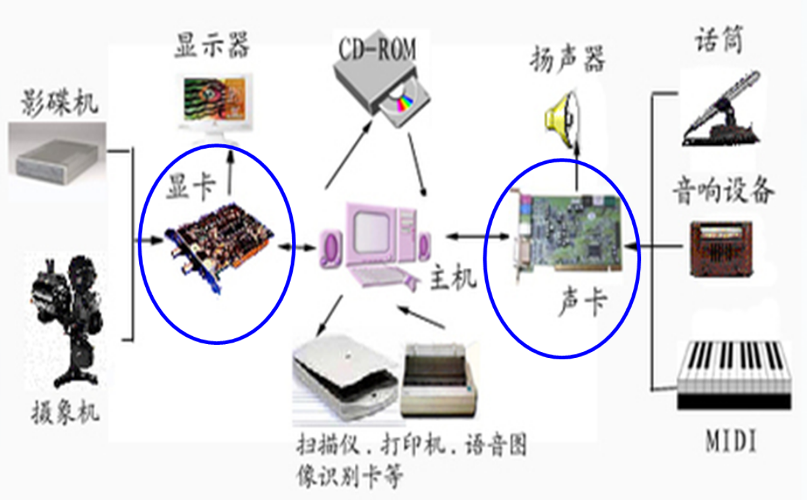
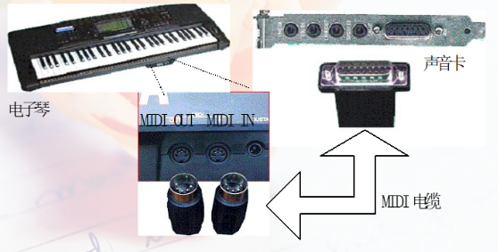
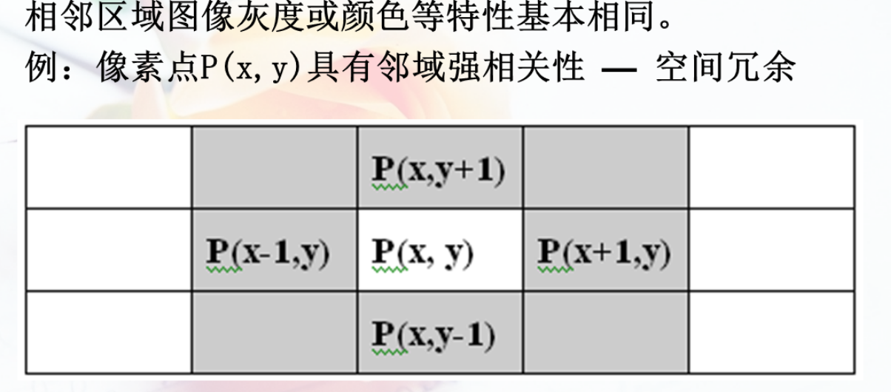
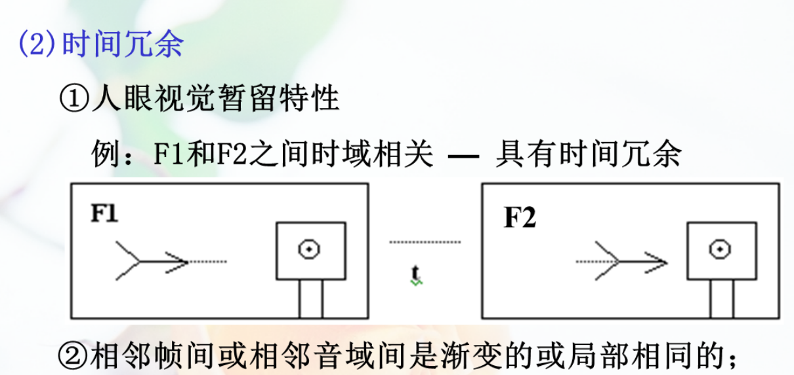
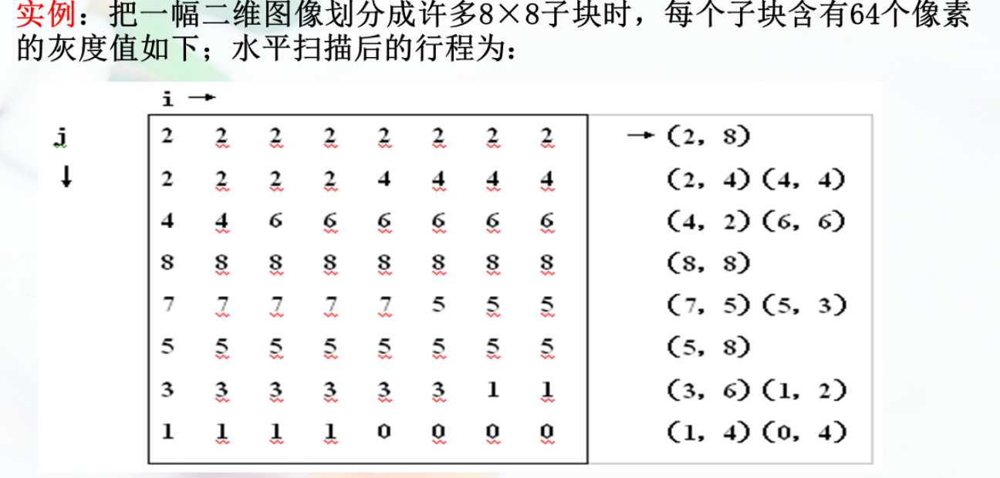

# 多媒体技术基础

## 多媒体技术概论

## 多媒体硬件环境

## 数字声音和语音编码

**MPC(MultimediaPersonalComputer多媒体个人电脑)**

软件系统：

1. 多媒体应用软件
2. 多媒体创作软件
3. 多媒体处理软件
4. 多媒体操作系统
5. 多媒体驱动软件

硬件系统

1. 多媒体硬件
2. 多媒体I/O控制卡及接口
3. 多媒体外围设备

### MPC技术标准与特征

**标准：**MPC1、MPC2、MPC3

**特征：**数字光盘存储设备；高质量的数字声音设备；高分辨率的图形、图像显示；带有多媒体管理如软件

### 音频接口

**音频卡**：处理音频信号的PC插卡是音频卡，又称声音卡，声音卡处理的媒体有：合成音乐（MIDI），数字化声音（WAVE），CD音频

**功能：**音频的录制与播放，编辑与合成 MIDI接口 CD_ROM接口 游戏接口

#### MIDI接口规范

MIDI(Musical Instructment Digital Interface)乐器数字接口标准

MIDI的音乐符号化的过程实际上就是产生MIDI数字信号的过程。

1. MIDI IN:接受其他MIDI装置传来的消息
2. MIDI OUT（输出口）：发送某装置生成的原始MIDI消息
3. MIDI Thru 传送从输入口接受的信息到其他MIDI装置

#### 声卡

1. 声音卡的技术标准
   1. 采样频率和量化位数
   2. MIDI合成方式
   3. DSP数字信号处理器
   4. 音频压缩

2. 声卡的声道数
   1. 单声道与立体声
   2. 四声道环绕
   3. 5.1声道

## 数字压缩技术

### 压缩的可能性

各种媒体数据内部存在**冗余（相关性）**所以可以采用不同编码与解码算法以减弱冗余，达到压缩目的

数据冗余类型：

1. 空间冗余

​	

2. 时间冗余

   

3. 熵冗余

   编码符号的序列中码字冗余，信息熵冗余

4. 其他冗余： 结构冗余，结构冗余

### 压缩指标

1. 压缩比：输入数据和输出数据之比

2. 压缩质量：压缩后在多大程度上接近压缩前的
   1. 有损压缩、无损压缩
   2. 信噪比，主观感受

3. 压缩速度和解压缩速度
4. 压缩和解压缩的标准化

### 压缩的过程

一、 **压缩的基本思想**
**针对数据冗余类型采用合适的压缩方法;**
**建立以少代多或以局部代全体的数据变换关系;从而以最少的数码表示信号。**
(1) 空间压缩:把相同视觉区当作一个整体进行表示。
(2) 时间压缩:把连续帧间的相同部分或渐变过程中的相似部分当作一个整体，用极少的数据量表示。

**二、压缩的过程**

（1）编码

原始数据符号化;体现压缩算法及正变换
(有内容信息→无内容的信号序列)
**信源编码器:**完成大部分压缩任务;
**信道编码器:**

1. 侧重解决传输可靠性的问题

2. 把压缩的位流转译成既适应存储又适合传输的信号
3. 降低信号调制/解调过程中的误码率

（2）解码

码元恢复与信号合成;体现解压算法及逆变换
(无内容的编码数据→有内容的还原数据）

（3）对称和非对称

压/解实时;压缩非实时，解压实时

- 实时解压缩是指在接收数据的同时进行解压缩，以还原原始数据

- 对称加密：在对称加密中，相同的密钥用于加密和解密数据。这意味着发送方和接收方都必须共享相同的密钥。对称加密算法通常比非对称加密算法更快速，因此在实时通信和数据传输中很有用。但是，对称加密存在一个安全性挑战，即如何安全地共享密钥。
- 非对称加密：在非对称加密中，存在一对密钥：公钥和私钥。公钥用于加密数据，而私钥用于解密。这种加密方式更安全，因为不需要共享私钥，但通常比对称加密慢得多，因此在实时通信中可能不太适用。

### 压缩的方法分类

| 压缩类型 | 编码技术 |                           |
| -------- | -------- | ------------------------- |
| 无损压缩 | 统计编码 | **行程编码**              |
|          |          | **霍夫曼**                |
|          |          | **算术编码**              |
| 有损压缩 | 变换编码 | 快速傅里叶变换（FFT）     |
|          |          | **离散傅里叶变换**（DCT） |
|          |          | 离散小波变换（DWT）       |
|          | 重要性   | **自带编码**              |
|          |          |                           |

### 1. 哈夫曼编码

#### 编码方案的效率的评判

信息量:**某信息消除不确定性的度量**。设信源X的符号集为$\huge X_i(i=1,2,…N)$，X.出现的概率为$\huge P(X_i)$

则X的信息量为:
$$
S(X_i)=-log_{2}P(X_i)
$$
式中底为2则单位为**bit(binarydigit)**
信息熵:信源数据所携带的**平均信息量。**故信源X的熵定义为:
$$
S(X) = -\sum_{i=1}^{n} P(X_i) log_2 P(X_i)
$$
若信源X的熵为2bit，意味着为X编码需要的平均码长为2。

然后计算编码的平均码长 $l_i$是对应编码的长度 $P(X_i)$是对应出现的概率
$$
\sum_{i=1}^n l_i P(X_i)	
$$
这就是熵编码原理的数学依据:**信源符号集的平均码长→S(X)**(最理想情况下会接近平均信息熵，一般情况下是平均码长比平均信息量要大)。
按熵值定义信源符号集的**最小平均码长**，设计编码方案。

#### 哈夫曼编码总结

1. 适用场合:可用于非均匀概率分布的信源编码
   只要码表以大量统计数据为基础，就能获得好的压缩效果。
   注意:均匀概率的信源，编码会产生定长码 - 失效。
2. Huffman树及编码不唯一，与信源初始条件和左右节点赋值{(0,1),(1,0)}有关;
   但平均码长应相等，故压缩效率相同。

### 2.行程编码

行程:具有相同灰度值的连续符号的长度;

示例：

编码结果:用13对(NL)数值取代了64个像元的灰度值以少代多思想

编码后，只要存储或传输两个数值(NL)，就可取代L个像元
的相同灰度值N;从而代替大量邻域冗余。

**适用场景：**适用于二值图像压缩，是传真编码的压缩方法;
在JPEG编码中，用于处理DCT交流系数。
**扫描方式：**行程越长压缩率越高。
应选择行程长的扫描方向:水平，垂直，之字形(Zig-Zag)

### 3. 算术编码

在JPEG扩展系统中取代Huffman编码。优点:
①用在数据概率分布较均匀的场合;与Huffman编码形成互补;
②压缩效率高出Huffman编码约5%。
(1)算术编码的基本原理
**基本思想:**基于递归概率区间划分的二进制编码。

**具体过程:**

1. 把信源符号序列{X|i=1,2,…,n}发生的概率用实数区间[0，1]上的间隔(X的取值范围)来表示;
2. 按符号概率大小来分配符号间隔，
3. 使[0，1]随迭代计算次数的增加而逐次变窄;
4. 最后范围便是替代{X.}符号串编码的取值范围
## 声音编码压缩技术

### 一些概念

***音频信号的分类***：语音信号和非语音信号
***声音的频谱***：线性频谱，连续频谱
**线性频谱**是具有周期性的单一频率的声波。
**连续频谱**是具有非周期性的带有一定的频带所有频率分量的声波。
**声音的A/D（模数转换）** 与 **D/A转换（数模转换）**（A 是Analog ，模拟；D是digital ,数字)

### 模拟音频数字化的过程
1. **音频采样**
2. **量化**
3. **编码**
采样和量化的过程可由A/D转换器实现。
A/D转换器以固定的频率去采样，即每个周期测量和量化信号一次，经**采样**和**量化**后声音信号经**编码**后就成为数字音频信号，可以将其以文件的形式保存在计算机的存储介质中，这样的文件一般成为数字声波文件。

过程示意图：

### 数字音频的文件格式

**1. WAV文件**
	WAV文件又称为**波形文件**，是对声音模拟波形的采样，WAV文件由**文件头**和**文件数据块**组成，文件头包括标志符，语音特征值，声道特征以及PCM（脉冲编码调制）格式类型标志等。WAV格式支持多种压缩算法、多种音频位数，采样频率和声道，但其文件尺寸较大，多用于存储简短的**声音片段**。
	未压缩声音大数据量可用下式计算：
	数据量（KB）=（采样频率KHz * 采样位数bit * 声道数 * 时间秒）/8
**2. MPEG音频文件——.MP1/.MP2/.MP3**
	MP3是MPEG标准中的音频部分，是一种有损压缩，根据压缩质量和编码复杂程度的不同可分为三层（MPEG Audio Layer 1/2/3),即MP1,MP2和MP3
	MPEG音频压缩率很高，MP1和MP2的分别为4：1何6：1~8：1,而MP3的压缩率高达10：1~12：1。一分钟CD音质的音乐未经压缩10MB，压缩后只有1MB，同时其音质基本不失真
3. VOC文件
4. AIFF文件（Audio Interchange File Format)
5. RealAudio文件——.RA/.RM/.RAM
### 声音质量的评价
三种方法可以衡量声音的质量。
1. 带宽衡量声音质量
	DAT（48KHz),CD(44.1KHz),FM(2.05KHz),AM(11.025KHz)和数字电话（8KHz）。
	示意图：
	
2. 信噪比（singal to  noise ratio,SNR)
	声音信号与噪音强度之间的比，信噪比越高表示音频质量越好
	$$SNR=20lg(\frac{V_{signal}}{V_{nosie}})$$ 
	单位是(dB)
	分贝：以$20\mu Pa$为基准，这是人耳能听到的最小的声音，大致相当于3米外一直蚊子在飞
3. 声音主观质量的度量
### 脉冲编码调制（Pulse Code Modulation，PCM）
它将模拟信号通过一系列固定时间间隔的采样得到离散样本，并将每个样本量化成一个二进制数字，然后通过串行传输将这些数字发送到接收端。**它是一种将模拟音频信号转换为数字形式的过程，也称为音频数字化。**
（1）PCM编码的原理
·波形编码：使重构语音信号的波形与原始信号波形尽量接近。
·概念上最简单、理论上最完善的编码系统，质量最好。

（2）步骤：
第一步是**采样**，每隔一段时间间隔读一次声音的幅度；
第二步是**量化**，把采样得到的声音信号幅度归属到量化电平。量化可归纳为两类：一类称为**均匀量化**，另一类称为**非均匀量化**。量化方法不同量化后的数据量也不同。因此，可以说量化也是一种压缩数据的方法；
第三步是**编码**，按一定格式记录采样和量化后的数据。

**均匀量化**：采用均匀的时间间隔度量采样得到的电平

**非均匀量化**：非均匀量化在某些情况下可以提高信号的编码效率。例如，在人类听觉系统中，对于低幅度信号的敏感度比高幅度信号要高，因此在音频信号编码中使用非均匀量化可以提高信号的编码效率，减少编码所需的位数，从而节省传输和存储空间。
大的输入信号采用大的量化间隔，小的输入信号采用小的量化间隔。这样就可以在满足精度要求的同时用较少的位数来表示。数据还原时采用相同的规则。

### 增量调制（DM）
PCM编码的变形， 是一种预测编码技术。如果实际的采样信号与预测信号之差极性为“正”（就是实际的比预测的大），则用1表示，相反则用0表示

- 增量调制器的输出不能跟踪输入信号的快速变化称为**斜率过载**。
- 在输入信号缓慢变化部分，输出交变的“0”和“1”。称为**粒状噪声**（granular noise），这种噪声是不可能消除的。
### 自适应脉冲编码调制（Adepted Pluse Code Modulation ，APCM）
- **根据输入信号幅度大小来动态改变量化阶大小的一种波形编码技术**。这种自适应可以是瞬时自适应，即量化阶的大小每隔几个样本就改变，也可以是非瞬时自适应，即量化阶的大小在较长时间才发生变化。
- 改变量化阶大小的方法有两种：**前向自适应**和**后向自适应**。前者是根据**未量化的样本值的均方根值**来估算输入信号的电平，以此来确定量化阶的大小，并对其电平进行编码作为边信息（side information）传送到接收端。后者是从量化器刚**输出的过去样本中来提取量化阶信息**。