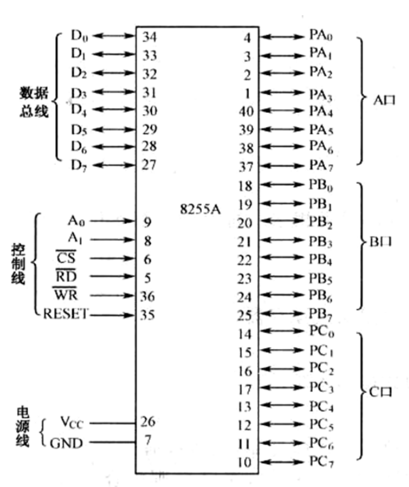
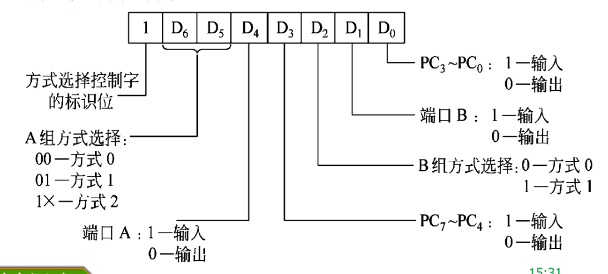

# 接口技术和微机技术
## 接口

微机接口就是微处理器 CPU 与外部世界的连接电路，是 CPU 与外界进行信息交换的中转站。
### 接口的功能
1. 对外部设备进行寻址的功能
2. 信号转换功能
3. 数据缓冲功能
4. 联络功能
5. 中断管理功能
6. 可编程功能
### 接口的组成
硬件电路
软件编程

### 接口的 I/O 端口
1. 状态端口
2. 数据端口
3. 命令端口
### I/O 端口的编址方式
1. 统一编址
2. 独立编址
	采用专门的 I/O 指令来访问具有独立空间的 I/O 端口
### CPU 与接口数据的交换
1. 无条件方式
2. 查询方式
3. 中断方式
4. 直接存储器存取方式——DMA 方式

## 8086 CPU 的一些概念
### Cpu 组成
Cpu 由 EU （execution Unit，执行部件）和 BIU （BUS interface unit，总线接口部件）组成，两者形成两级流水线
#### EU 的组成
4 个通用寄存器 ax bx cx dx
4 个专用寄存器 sp（stack pointer） bp di si
1 个 16 位算数逻辑单元
1 个 16 位标志寄存器 PSW
EU 控制电路
#### 总线接口部分

5 个段寄存器 cs ds ss es ip

### CPU 微处理器引脚功能

最小模式
最大模式

### 8086微处理器 引脚功能

#### 工作模式

最小模式：

系统只有一个8086一个微处理器

最大模式：

包含两个或两个以上的处理器

#### 引脚：

**BHE：** 高8位地址总线允许/状态信号，输出

**READY：**表示CPU访问的存储器或I/O端口已经准备好数据了

**ALE：**8086处理器使用16位地址总线来寻址外部设备。当8086处理器需要将地址传输到外部总线上时，它会通过ALE引脚发出一个脉冲信号。这个脉冲信号的上升沿会触发外部设备对地址进行锁存，以便外部设备可以读取或响应该地址。

**M/IO:** 当M/IO引脚为高电平时，处理器将通过数据总线传输内存数据。这意味着，处理器将把内存地址放在地址总线上，并从内存中读取或写入数据。这种传输方式通常称为存储器总线操作。当M/IO引脚为低电平时，处理器将通过数据总线传输I/O数据。这意味着，处理器将把I/O端口地址放在地址总线上，并从I/O端口读取或写入数据。这种传输方式通常称为I/O总线操作。

DEN/S2:DEN是数据使能信号，用于控制数据的传输。当DEN引脚为低电平时，8086将在数据总线上输出有效的数据。当DEN引脚为高电平时，数据总线上的数据将被禁用。

DT/nR

1. 数据传输（DT）功能：
   当DT/nR引脚处于高电平时，它被用作数据传输（Data Transfer）控制引脚。在这种模式下，DT/nR引脚用于控制8086与外部设备之间的数据传输。当引脚处于高电平时，数据可以在8086和外部设备之间进行双向传输。
2. 总线复位（nR）功能：
   当DT/nR引脚处于低电平时，它被用作总线复位（Bus Reset）控制引脚。在这种模式下，DT/nR引脚用于将8086的外部总线复位。当引脚处于低电平时，会触发一个复位信号，将8086的内部状态和外部总线恢复到初始状态。

74HC273锁存器：

MR: MR引脚用于将74HC273的所有触发器置于复位状态。当MR引脚为低电平（或使能）时，所有的触发器将被复位，即其输出将被强制为低电平。这意味着，无论之前的输入数据是什么，触发器的输出都将被清零。当MR引脚为高电平时，触发器将根据输入信号进行正常的工作，即根据时钟信号和D输入信号更新其输出状态。

74HC245锁存器

CE:当CE引脚处于高电平（通常为Vcc电源电压）时，74HC245处于使能状态，可以正常工作。在这种情况下，数据可以从A端输入引脚（A0-A7）输入到B端输出引脚（B0-B7），或者从B端输入引脚输入到A端输出引脚。数据传输的方向由方向控制引脚（DIR）确定。

当CE引脚处于低电平（通常为地）时，74HC245被禁用，处于锁存状态。在锁存状态下，输入数据被保持在器件内部的锁存器中，不会传输到输出端口。这种功能对于需要保持数据稳定性或者需要在特定时刻进行数据传输的应用非常有用。

AB/BA:当DIR引脚处于高电平（通常为Vcc电源电压）时，数据传输方向是从A到B，也就是A端作为输入，B端作为输出。在这种情况下，数据从A端输入引脚进入74HC245，并从B端输出引脚输出。

## 可编程并行接口 8255 A

### 概述

概述 8255 A 是一款广泛用于微处理器系统中的**并行 I/O（输入/输出）接口芯片**，(就是指 8 位、16 位或者 32 为传输单位) 由 Intel（现在的英特尔）公司设计和制造。该芯片有多个操作模式，可用于控制数字输入和输出，因此在嵌入式系统、计算机外设和工业控制等领域得到了广泛应用。

三个输入输出端口：端口 A、端口 B、端口 C。每个端口都可通过编程设定为**输出端口**或者为**输出端口**，但是各自又不同的方式和特点。

端口 C 可作为一个独立的端口使用，但是通常配合端口 A 和端口 B 工作，为这两个端口的输入和输出提供**控制联络信号**
·

### 内部结构

接口图

内部结构图：

(1)三个 8 位端口 A、B、C
**与外设相连，与外设交换数据、控制和状态信息.**
1)端口 A 和端口 B：含一个 8 位输出锁存器和一个 8 位输入锁存器。作为输入或输出端口时，数据均被锁存.
2)端口 C：含一个 8 位数据输出锁存器和一个 8 位的数据输入缓冲器. 作为**输出时能对数据进行锁存**，**输入时不能锁存.**端口 C 可以分成两个 4 位端口，分别可以定义为输入端口或输出端口，还可定义为控制、状态端口，以配合端口 A 和端口 B 工作.
(2) A 组和 B 组
1)**端口 A 和端口 C 的高 4 位 (PC 7~PC 4)构成 A 组**，由 A 组控制部件来对它进行控制。
2)**端口 B 和端口 C 的低 4 位 (PC 3~PC 0)构成 B 组**，由 B 组控制部件对它进行控制.
**A 组和 B 组各有一个控制单元，接收来自数据总线送来的控制字，并根据控制字确定各端口的工作状态和工作方式**

(3)数据缓冲器

数据缓冲器是一个双向的三态 8 位缓冲器，它与 cpu 系统数据总线相连。

**输入数据，输出数据，控制命令字**都是通过数据总线缓冲器进行传送的。

(4)读/写控制逻辑

读写控制逻辑接收来自 CPU 地址总线（$A_0 A_1$ 就是地址总线）的信号和控制信号，并发出命令到 A 组和 B 组，

1. 把 CPU 发出的控制命令字或输出的数据通过数据总线缓冲器送到相应的端口，
2. 把外设的状态或输入的数据从相应的端口通过数据总线缓冲器送到 CPU。

### 控制字

可编程并行接口芯片，**可编程就是用指令的形式先对芯片进行初始化，**设置芯片的端口是处于输入状态还是输出状态以及每个端口的工作方式。

1. 8255 A 通过设置控制字来决定他的工作方式
2. 控制字分为两类：
   1. 工作方式控制字，可使 8255 A 的三个数据端口工作在不同的方式
   2. C 端口按位置位/复位控制字，它可使 c 端口中任何一位进行置位或复位

### 工作方式选择控制字

### 工作方式

1. 方式 0 基本输入输出方式

   **功能：**方式 0 是 8255 A 的最简单工作模式之一，它将 8255 A 的三个 8 位 I/O 端口（Port A、Port B 和 Port C）配置为一个单独的 8 位输出端口。这意味着三个端口同时用于输出，并且可以通过控制字配置输出的数据。

   基本输入输出方式适用于无条件传送和查询方式的接口电路;
   不需要应答联络信号;
   端口 A、B 和 C 的高 4 位及低 4 位都可以作为输入、输出端口;

2. 方式 1 选通输入输出方式
   适用于查询和中断方式的接口电路;
   A 和 B 口可用方式 1，但要利用 C 口提供 3 个固定的信号，联络外设和 CPU。

   **功能：** Mode 1 将 8255 A 的三个 8 位 I/O 端口分成两个组，Port A 和 Port B 组成一个双向数据总线，而 Port C 独立作为一个输入端口。这允许数据在 Port A 和 Port B 之间双向传输，而 Port C 用于输入

   当 A 口和 B 口都为方式 1，则 C 口的 6 位被占用; C 口的其他 2 位可作为方式0使用。
   A 口或 B 口中，一个为方式 1，另一个为方式 0，则 C 口中有3位被占
   用; 而其它 5 位可工作于方式 0，设为输入或输出。

3. 方式 2 双向选通输入输出方式

   方式 2: 双向选通传送方式
   适用于双向传送数据的外设
   适用于查询和中断方式的接口电路

## 中断系统和中断控制器 8259 A

### 8086 CPU 的中断系统
#### 中断系统的作用
- 多外设
- 实时处理
- 故障处理
#### 中断源
- 外部设备
- 定时中断
- 故障请求中断
- 程序性中断
外部中断：由连至 CPU 引脚上的信号引发
内部中断：由程序中断源引发
#### 中断屏蔽
为了增加中断控制的灵活性，CPU 和 I/O 接口中分别设置触发器。
- CPU 内部中断允许触发器（PSW. IF，控制可屏蔽中断）
	- 为 0：关中断，指令 CLI
	   为“1：开中断，指令 STI
	- 可屏蔽中断（INT）受中断允许触发器控制：
	- 非屏蔽中断（NMI）**不受中断允许触发器控制**：
- 在接口电路中，设置中断请求触发器和中断屏蔽触发器
	- 有中断请求时中断请求触发器置 1；
	- 若中断屏蔽触发器为“0，该请求送往 CPU，CPU 响应后触发器清“0
	- 若中断屏蔽触发器为“1，该请求不送往 CPU，称该中断请求被屏蔽
#### 中断优先级
几个中断源同时请求中断，而 CPU 一次只能为一个中断服务；
  事先为每个中断源确定一个中断优先级
  CPU 一般首先响应优先权高的中断请求
#### 中断嵌套
  允许高优先权中断源打断优先权低的中断服务，称为中断嵌套
 若新的中断源为同级或低级，（一般）不能打断正在处理的中断服务。
### 8259 A 简介
#### 中断控制器 8259 A 功能
现代计算机采用功能很强的中断系统，可同时处理多个中断源，配置中断控制器管理外部中断，功能如下：
1. 接收外部的**中断请求**；
2. 确认当前**优先级**最高的请求，并送至 CPU 的 INTR 引脚
3. 当 CPU 响应中断时，提供**中断类型码**：
4. 中断处理过程中**屏蔽**低优先权的中断请求，而允许高优先权的中断请求送出，实现中断嵌套；
5. Intel 8259 A 是典型的中断控制器芯片，广泛应用于微机系统中。
#### 8259 A 的性能概述
- 每片 8259 A 能管理 8 级中断，可采用 9 片级联构成主从式 64 级中断管理系统；
- 每级中断都可以被**屏蔽或允许**；
- 中断响应期间提供**中断类型码：**
- 允许多级中断**嵌套；**
- 可设置**多种**优先权管理方式及屏蔽功能；
- 可编程选择不同的**工作方式**
- 提供**中断查询**（中断查询（Interrupt Polling）是一种中断处理方法，用于检查外部设备是否发生了中断请求，而不是依赖硬件中断信号来通知计算机系统。），使得 CPU 在关中断的情况下仍可通过查询为特定中断服务。
#### 8259 A 的结构和引脚
示意图：

##### 8259 A 的引脚功能
- 电源 VCC 和接地 GND
- **中断请求输入线**IR 7~IRO：接受来自外设或 8259 A 从片的中断请求信号，可设置为上升沿或高电平触发；
- 双向三态数据线 D 7~DO 与系统数据总线相连；
- 中断请求线 INT：输出信号，与 CPU 的 INTR 相连，向 CPU 送中断请求信号；
- 中断响应线 INTA：接收 CPU 发来的中断响应信号，8259 A 接到此信号后，送中断类型码：
- 片选信号 CS： 高位地址译码产生；
- 地址线 AO： 选择 8259 A 内部不同寄存器；
- 读信号 RD：读取 IRR、ISR 和 IMR
- 写信号 WR：写入控制字；
- 级联线 CAS 2~CASO：主从系统中所有 CAS 2~CAS 0 引脚对应连接在一起，与 SP/EN 信号配合级联。8259 A 主片**用于输出**，**从片用于输入**。**在 CPU 响应中断时，主片用 CAS 2~CAS 0 选中对应的从片，三个引脚信号的不同组合 000~111，对应于8个从片**
- 从片编程/缓冲使能 SP/EN：双向。在**非缓冲**方式下，用作输入线 SP，SP=1 表示该 8259 A 为主片，否则为从片；缓冲方式下用作输出线 EN，控制外接数据缓冲器的接收和发送。
	-  在非缓冲方式下，"SP/EN" 用作输入线 SP（Slave Present），表示该 8259 A 控制器是主片还是从片。
		- 当 SP=1 时，表示该 8259 A 控制器是主片（Master），用于处理中断请求。
		- 当 SP=0 时，表示该 8259 A 控制器是从片（Slave），通常用于级联连接多个 8259 A 控制器以处理更多的中断请求。
	- 在非缓冲方式下，"SP/EN" 不用作输出线。
		- 在缓冲方式下，"SP/EN" 用作输出线 EN（Enable），用于控制外接数据缓冲器的接收和发送。
		- 当 "SP/EN" 为高电平时（EN=1），外接数据缓冲器被启用，允许 8259 A 控制器发送中断请求和接收中断控制命令。
		- 当 "SP/EN" 为低电平时（EN=0），外接数据缓冲器被禁用，停止发送和接收操作。
##### 内部结构
 **中断请求寄存器 IRR**：8 位，用于锁存中断请求信号。当相应的引脚有中断请求时，寄存器的相应位置 1；
**优先权判别电路 PR**：识别同时申请的中断的优先级，允许嵌套时须考虑正在服务中断的优先级别，然后送出最高优先级中断源，并在 CPU 响应周期中将中断服务寄存器 ISR 的相应位置位。
**中断服务寄存器 ISR**：8 位，记录已响应的中断。该位由普通或特殊 EOI 命令复位。中断嵌套时，会有多个位同时被置位，对应已响应而又未处理完毕的多个中断
**中断屏蔽寄存器 IMR**: 8 位，存放被屏的中断，由编程设定。当 IMR 中某位被屏蔽即使 IRR 对应位被置位，其中断申请也不能送往 CPU；
**数据总线缓冲器**：8 位双向三态缓冲器，是 8259 A 与 CPU 间的数据传输通道。写入控制字，读出状态信息。中断响应周期内，向 CPU 送中断类型码
**级联缓冲比较器**：实现 8259 A 的级联，构成主从式扩展中断管理系统；
**读写控制逻辑**：根据编程设定工作方式产生片内控制信号：据 IRR、IMR 的内容和 PR 的判断结果向 CPU 发出中断请求；并接受来自 CPU 的中断响应信号。
#### 8259 A 工作过程
1. 1 个或同时多个外部中断请求送至 8259 A 引脚
2. IRR 接收中断请求并锁存，相应位置置位 1；
3. 根据 IMR 的屏蔽情况决定是否允许中断请求进入 PR；
4. PR 判别当前优先级最高的中断请求（允许嵌套时还要参考 ISR 的状态），根据判优结果决定发送 INTR 信号或等待
5. 若 IF=1（8086 CPU 标志寄存器 FR 中的一位，IF=1 表明允许中断）, 发送 INT 信号，8259 A 使 ISR 相应位置位，同时将 IRR 相应位清零避免重发请求
6. 然后 CPU ***发送第二个 INT*** 后 8259 A 送出类型码
7. 若为 AEOI 方式（自动结束），直接清除 ISR 相应位置，否则需要在中断服务结束时，由 CPU 送出普通或特殊中断结束命令 EOI，清除 ISR 响应的位，标志一个中断结束
### 8259 A 的工作方式
#### 中断触发方式
1. ***电平触发***
	中断请求线上出现**高电平**为有效请求信号。
	对其时间有限制：过短，不能触发；过长，重复触发
	要求触发高电平持续至 cpu 响应总线周期中第一个 INTA 脉冲
2. ***边缘触发***
	中断请求线上出现**上升沿**为中断请求信号，触发后一直保持高电平也不会重复触发。常用负脉冲的后沿实现，**同时要防止第 1 个 INTA 信号有效前出现新的中断请求脉冲。**
#### 屏蔽中断源的方式
清除 IF 指令（CLI）可使 CPU 屏蔽所以可屏蔽中断，但无法屏蔽**选择性屏蔽**。
8259 A 可选择性屏蔽。
1. 普通屏蔽方式
	将中断屏蔽寄存器 IMR 的某些位置 1，选择性屏蔽对应编程
2. 特殊屏蔽方式
	有时希望一个**中断服务程序内可动态改变优先权结构**：中断服务程序的一部分希望禁止中断，而到另一部分时又能够开放中断。可用特殊屏蔽解决该问题，CPU 只对本级中断屏蔽，允许级别比它高或比它低的中断源申请中断。例子：如 IR 3 中断服务过程中，需要从 IR 5 的外设上读取数据。使得低优先级也有机会得到服务。

#### 中断优先权的四种方式
1. <mark style="background: #FF5582A6;">普通全嵌套方式</mark>：IR 7-IR 0 优先级依次升高，**是固定优先级顺序**
2. <mark style="background: #FF5582A6;">特殊全嵌套方式</mark>：顺序与普通全嵌套相同，但允许**同级中断嵌套**。用在级联系统中，主片设为特殊全嵌套，当从片某中断请求被处理时，从片较高优先权中断源能够得到响应。
3. <mark style="background: #FF5582A6;">优先权自动循环方式</mark> ：优先权自动循环：各中断源重要性差别不大时，优先权顺序变化。一个中断服务结束后，优先级自动降为最低，下一级升为最高
4. <mark style="background: #FF5582A6;">优先权特殊循环方式</mark>：优先权特殊循环方式：与自动循环类似，但初始最低优先级是在主程序或中断服务程序中由命令字指定，而不是刚刚处理完的中断。
#### 中断结束（EOI）的三种方式
1. <mark style="background: #FF5582A6;">自动结束方式</mark>（有风险但是简单）：
	Cpu 一旦中断响应 8259 A 将自动 ISR 相应位置清零。由于不能再为 PR 提供判优依据，会造成重复嵌套。
	常用在不允许中断嵌套或保证不出现中断嵌套的情况下
2. <mark style="background: #FF5582A6;">普通结束方式</mark>
	CPU 用 out 指令发送一个普通 EOI 命令，8259 A 收到后将 ISR 中已置 1 的具有最高优先级的位清 0；
3. <mark style="background: #FF5582A6;">特殊结束命令</mark>
	特殊屏蔽时低优先级的被服务，不应清楚 ISR 中最高优先级位，需要 cpu 发送特殊的 EOI 命令
注意：级联方式下一个中断结束要发送两次 EOI 命令，分别清楚主从 ISR 中的相应位。
#### 级联方式
- 一个主片可以带至多 8 个从片，将中断源扩展到 64 级；
- 从片的 INT 接至主片的 IRi 端，从片上的中断请求通过主片的 INT 送至 CPU；
- CPU 的中断响应信号 INTA 分别送至主、从片上；
- **主片在级联线 CAS 2~CAS 0 上送出标识符编码，对应编码相同的从片可以获得 INTA 信号；**
- **在第二个 INTA 负脉冲时，主片不动作，由从片送上中断类型码；**
- 通常主片的优先权控制采用特殊全嵌套方式，允许同级中断产生嵌套。
#### 连接总线的方式

**缓冲方式：** 在多片 8259 A 级联的大系统中，8259 A 通过总线缓冲器与系统数据总线相连，SP/EN 用作输出 EN，控制总线缓冲器的数据传送；
**适用于在数据线上设有数据缓冲器的大型系统。**

**非缓冲方式：** 当系统中只有一片或几片 8259 A 芯片时，8259 A 直接与数据总线相连。单片系统，SP/EN 接高电平；多片级联系统，主片 SP/EN 接高电平，从片 SP/EN 接低电平。

#### 中断查询方式 
- CPU 不是通过中断响应获得中断类型码，而是通过查询获得中断请求；
- 在 IF＝0，CPU 关中断的情况下，CPU 仍可通过查询为特定中断服务。 
**中断查询方式：** CPU 内部的中断允许触发器复位, 所以禁止了外部对 CPU 的中断请求。
中断查询方式可以用在多于 64 级中断的场合。例如系统有 128 个中断源，则其中 64 个用常规方式接 CPU 的 INT 和 INTA*，另外的 64 个只能用查询方式。
中断查询方式也可以用在一个中断服务程序中的几个模块分别为几个中断设备服务的情况。多个相关或相似的中断源。
### 8259 A 的编程
8259 A 工作方式可以编程设定
1. 初始化命令字 ICW 1～4：
	8259 A 开始工作前，必须首先写入 ICW，使其处于预定的初始状态，并明确其所处的硬件环境；
	ICW 设定后在整个工作过程中保持不变。
2. 操作命令字 OCW 1～3：
	控制 8259 A 执行不同的操作方式；
	8259 A 工作期间，任意时刻都可以通过重置 OCW，动态改变 8259 A 的操作方式。

####  8259 A 的端口
- 8259 A 占用**两个 I/O 端口地址**，通过 A 0 引脚区分:
- 通常称低的地址为**偶地址**，而高的地址为**奇地址;**
- 8259 A 内部并不是只有两个寄存器，为**区分对不同寄存器 (命令)的输入/输出操作**，需要采用在控制信息中加**特征位**或者规定有关**操作顺序**等方法。
#### 初始化命令字
8259 A 开始工作时，必须首先写入 ICW，使其处于预定的初始状态，并明确其所处的硬件环境；
ICW 设定后整个工作过程中**保持不变**（除非断电重启）

***ICW 1:***

***ICW 2***:

高 5 位自己设置，随便设置，不要和系统的中断类型冲突
后三位是 8 级中断类型码，对应 8 个中断请求线

***ICW 3***：

***ICW 4***：

***说明：***
- ICW 3 用在 8259 A 工作于级联方式，即 ICW 1 的 D 1=0；
- 主片 ICW 3 的 S 7～S 0 分别对应于 IR 7~IR 0 的连接情况。
- 从片 ICW 3 的 D 7～D 3 位设为 0，D 2～D 0 位指明该从片连至主片的哪一个 IRi 引脚。
- 级联方式下，主、从片的 CAS 2~CAS 0 对应连接。当 CPU 发出中断响应信号时，<mark style="background: #ADCCFFA6;">主片通过 CAS 2~CAS 0 送出一个编码，从片将其与本身 ICW 3 的 D 2～D 0 位比较。若相等，则将它的中断类型码送数据线。</mark>

#####  初始化规则
- 开始工作前，**每一片**8259 A 都要通过写入 ICW**初始化;**
- ICW 1~4 的写入顺序固定，其中 ICW 1, 和 ICW 2 必须设置，而 ICW 3 和 ICW4可选;
- **ICW 1**写入偶地址，并指明是否要**ICW 3 和 ICW 4;**
	- 写入 ICW 1 启动 8259 A 的初始化，内部电路自动完成: 边沿触发、电路复位、**IMR（Interrupt Mask Register 用于屏蔽或允许特定中断请求线）清 0**、**IR 7（Interrupt Request 7 是指 8259 A 芯片中的 IRQ 7，对应着第 7 个中断请求线）被置为最低优先级**、普通全嵌套方式、固定优先权排序、清除特殊屏蔽方式、读 IRR 状态;
- ICW 2~4 写入奇地址，按写入顺序加以区分;
- 级联方式下，主、从片都需设置 ICW 3。
***示意图：***

#### 操作命令字

***OCW 1（写中断屏蔽 IMR）***

***OCW 2***

- 控制**优先权方式**和**中断结束方式**，写入偶地址;
- D 4 D 3 是特征位;
- R: 优先权控制位，若 R=1 循环优先级，R=0 固定优先级;
- SL: 指定 L₂~L。位是否有效，SL=1，L 位有效; SL=0, L 无效;
- EOI: 中断结束命令位。当 ICW 4 中 AEOI=0，则中断服务程序最后不会发中断结束 (EOI)，则需要将 OCW 2 作为 EOI 命令，用以清除 ISR 的对应位;
- L₂~L。：（就是类似一种参数）位: 在 SL=1 时有效，编码指示对应要操作的中断级别。

例子：
OCW 2=100 00000，设置工作于中断优先权自动循环方式，即中断处理过程中，ISR 对应位置 0，同时降低为最低优先级；
OCW 2=011 00011，特殊 EOI 命令，指定清除 ISR 的 D3位；
OCW 2=111 00010，特殊 EOI 并设置优先权特殊循环，指定 IR 2 为最低优先级。

***OCW 3***

三个功能：**读 IRR 和 ISR**；**设置是否使用特殊屏蔽**(只对本级中断屏蔽，允许级别比它高或比它低的中断源申请中断。目的是临时开放低级中断)；**设置是否使用中断查询**；
$D_1 D_0$ =11 读中断服务寄存器 ISR；$D_1 D_0$  =10 读中断申请寄存器 IRR。
$D_6 D_5$ =11 设置特殊屏蔽；$D_6 D_5$ =10，撤销特殊屏蔽。
$D_4 D_3$ =01，特征位；
$D_2$ =1 使 8259 A 处于中断查询方式，随后执行输入指令 IN。
	读入数据表明是否有中断，并提供最高优先权的中断。
	
	$D_7=I=1$ 表示有中断请求，否则无请求；
	$W_{2}$ ~$W_0$ 给出当前优先权最高的中断请求的代码。
	【例】当 CPU 发来一个 OCW 3 查询命令（D 2=P=1），此时 8259 A 的优先权次序为 IR 3、 IR 4、 IR 5、…… 、 IR 2，且 IR 4 和 IR 2 有中断请求。当 CPU 随后执行一条输入指令，便可得到查询字：84 H。说明有中断请求，且优先权最高的为 IR4 。

### 级联方式编程
- 8259 A 有非缓冲和缓冲两种级联方式
	- 非缓冲方式 ：主、从片的区分由 SP/EN 引脚的高低决定；
	- 缓冲方式：8259 A 主从关系由 ICW 4 的 BUF、M/S 位组合确定。
- 主、从片必须分别初始化，主片通常设置为特殊全嵌套方式；  
- 中断服务程序需要发送两条中断结束命令 EOI 
	- 首先发一条普通 EOI 给引起中断的从片，然后读取该从片的 ISR；
	- 若 ISR=0，说明当前中断是片上唯一被响应的中断，则向主片发一条普通 EOI 命令；
	- 若 ISR≠0，说明该从片上还有其他中断请求未处理完毕，此时不应向主片发 EOI 命令。 

## 8253 可编程定时/计数器
#### 用处
- 分时操作系统，以便切换线程。
- 统计外部事件发生的次数。
- 检测外部事件发生的频率或周期。
- 在定时或计数达到预定值后，向 CPU 申请中断。
- 向 I/O 设备周期性输出精确的定时信号。
- 用作可编程波特率或速率发生器。 
#### 定时的实现
1. 软件定时（因为每条指令的运行时间一定，所以可以定时），缺点是降低了 cpu 的利用率
2. 硬件定时： 555 电路，由阻容控制不受软件控制，无法修改，精度欠佳
3. 可编程接口芯片定时 Intel 8253
#### 外部引脚

输入引脚：
	CS: 片选信号
	RD: 读运行信号
	WR：写芯片
	A 0/A 1 地址线
连接外部设备：
	CLK：要计的时钟，是输入
	GATE：控制信号，门控信号，门控信号，用于启动/停止定时或计数工作的控制. 该信号有效时定时/计数器才开始工作
	OUT：输出，当计数完成的时候就输出

#### 内部结构

每个计数器：

减一计数器：一个<mark style="background: #FF5582A6;"><mark style="background: #FF5582A6;"> 16 位减 1 计数寄存器<mark style="background: #FF5582A6;"></mark></mark></mark>，初值为初值寄存器的值. CLK 输入一个脉冲，减1 计数寄存器的内容减 1，减到 0 时，Out 输出，只要由脉冲就计数，<mark style="background: #FF5582A6;">gate 不能控制他，gate 控制的是锁存器</mark>

#### 编程
 寻址方式：

控制字

因为数据线是 8 位的所以写 16 位要分两次写
#### 工作方式
##### 方式 0——计数结束后输出由低变高
特点：
1. 计数器只计一遍数。当计数到 0 时，并不恢复计数器初值，OUT 由低变高且一直保持
##### 方式 1——可重复触发的单脉冲（GATE 触发）
与方式 0 的区别
1. 是否需要重新初始化置数
##### 方式 2——分频器
##### 方式 3——方波发生器
##### 方式 4——软件触发的选通脉冲触发
特点：在计数过程中若改变计数初值则按新的计数初值开始计数. 这称为软件再触发
##### 方式 5——硬件触发的选通脉冲触发器
特点：方式 4 软件更改计数初值后立即起作用，方式 5 软件更改计数初值后要有门控信号的角触发才能起作用。

## 串行通信和串行通信可编程接口 8251
### 串行通信
并行：多条传送线速度相对高，适宜近距离
串行：节省传送线，速度相对低，适宜远距离
#### 数据传送方式
1. 单工通信 (Simplex): 仅能一个方向数据传送

2. 全双工通信（Full duplex）：AB 均能在发送的同时接收

3. 半双工通信 (Half Duplex )：交替进行但是不能同时进行

### 异步传送与同步传送
**收发两端必须相互协调**: <mark style="background: #ADCCFFA6;">约定速率</mark>与<mark style="background: #ADCCFFA6;">判定起始</mark>
约定速度：采样的时间间隔
判定起始: 接收端数据线和采样时刻, 异步和同步
#### 异步传送
收发方的频率差在十分之一内
同时要**确定字符格式**和**波特率**
##### 字符格式
字符的编码形式的规定
四个部分：1 个起始位，5~8 个数据位，0~1 个奇偶校验位，1~2 个停止位

每个字符传送前，传输线处于“1”状态，**当“1”变为“0”并持续 1 码元时间时，就表明这是起始位**，后面就是**数据位，先送低位，后送高位**。
直到收到完整字符。
一个字符传送完后立即传送下一个; 如后续数据跟不上，则加入空闲位 1。
##### 波特率
波特率：每秒钟传送的二进制位数。发端和收端**波特率必须一致**。
设传送速率是120字符/s，而每个字符有10个位(1个起始位、7个数据位、1个校验位和1个停止位)，则波特率为：

     120字符/s*10 bit/字符=1200 bit/s=1200波特

   每个数据位的传送时间T为波特率的倒数：

      T ＝1/1200＝0.000 833 s＝0.833 ms

 可选波特率有300、600、1200、2400、4800、**9600**、19200和**115200**。通常用波特率除以10估计每秒钟传送的字符数。
#### 同步传送
同步传送是指**去除起始位和停止位**，而是用**1~2个同步字符表示数据块传送的开始**，**数据块以连续的形式发送**，一次传送可达几十到几百个字节。

每个**发送时钟周期(TxC)** 发送一位，故同步传送中要求对传送信息的每一位都必须在收、发两端严格保持“位同步”。通常发送器和接收器比较复杂，成本较高。

用于同步通信的数据格式有多种。
1. 单同步数据格式
   
2. 双同步格式数据格式
   
3. SDLC 同步数据格式（Synchronous Data Link  Control）
   
4. HDLC 同步数据格式 (High-level Data Link Control)

##### 信号的调制
高低电平占用很宽的频带，且有很大**直流成分**（直流成分意味着电流或电压持续保持一个恒定的数值，不随时间变化），因此仅适用于在短距离传输（1m）。如果用电话线传输，信号将会出现畸变。
为了克服畸变，在发送端把信号转换成适于传输的**模拟信号(调制)**，接收端再将模拟信号转换成电平信号(解调)。完成调制、解调功能的设备叫做调制解调器(Modem)。
适用于异步通信方式，它不提供同步时钟信号。常用的调制方法是频移键控(FSK，Frequency Shift Keying) 。
例子：

### 串行通信接口芯片

>TTL（Transistor-Transistor Logic）电平是一种常用的数字逻辑电平标准，它用于描述逻辑门电路中的高电平和低电平状态。
根据 TTL 标准，高电平（High level）通常被定义为大约2.4V 到5V 之间的电压范围，而低电平（Low level）通常被定义为0V 到0.8V 之间的电压范围。这意味着在 TTL 电平定义下，如果电压在2.4V 以上，那么信号被认为是高电平；如果电压在0.8V 以下，信号则被认为是低电平。

**Intel 的8251以及 National Semiconductor 的8250等完成 TTL 电平的*并串或串并转换***。
为了增大传送距离，可在串行接口电路与外部设备之间增加信号转换电路。如 RS–232收发器、RS–485收发器和 Modem 等。
- RS–232将 TTL 电平转换为±15 V 电压传送，最大距离15 m。
- RS–485收发器将 TTL 电平转换为差分信号传送，最大传送距离为1.2 km。
- Modem 将电平信号调制成频率信号送入电话网，如同音频信号一样在电话网中传送。
### 可编程串行接口芯片8251A
**功能**：数据格式化、串并转换、控制波特率、校验、电平转换、提供 RS-232控制信号线。
**特点：**
-  可异步，可同步。
- 异步，停止位可为1位、1位半或2位。
- 同步，可设为单同步、双同步或外同步。
- 可设定奇偶校验或不校验，校验都由芯片完成。
- 异步通信的时钟频率可设为波特率的1倍、16倍或64倍。
- 波特率可设定。
- 提供调制解调器的联络信号。
- 收、发送数据分别有各自的缓冲器，可全双工通信。
#### 内部结构

**C/D: 地址线**（相当于 $A_0$）如果是 0 则是 D（data），如果是 1 则是 C(command)
CLK: 芯片工作的时钟
reset：复位信号，（复位之后设置工作方式）
DSR，DTR，CTS，RTS 控制信号和调制解调器联络用的
TxD (Transit data): 发送信号，
发送缓冲器：只有一个字节，存发的信息
TxRDY（TxReady）告诉 cpu 说已经发送出去了，现在是空的，可以再接收 cpu 的数据（往往是中断请求）（对应的是发送缓冲器）
TxE （）：代表真正转换完毕发送完了
TxC：波特率是这个信号分频得到的
RxD：接收信号
RxRDY：接收完毕
#### cpu 控制

**读写控制**：

**收发联络信号**
- TXRDY—发送准备好信号，输出，高电平有效。当发送寄存器空且允许发送(命令字中 TXEN 位为1)时，TXRDY 输出为高电平，以通知 CPU 当前8251A 已做好发送准备，CPU 可以向8251A 传送一个字符。当 CPU 把发送的数据写入8251A 后，TXRDY 恢复为低电平。

  TXRDY可作为8251A向CPU发送的中断请求信号(发送中断)。也可作为查询方式的联络信号。

-  TxE—发送器空。输出，高电平时表示并—串缓冲器空。

- TxE 与 TXRDY 的区别：TXRDY 表示发送缓冲器的状态，而 TxE 表示经发送数据缓冲器的并—串转换器的状态。

- TXD:发送数据输出线。

##### 与调制解调器的连接
（1） 控制发送的
RTS：请求发送，输出，低有效。用于通知调制解调器 CPU 准备发送数据。初始化时 CPU 将控制寄存器的 D5位置1，可使 RTS 变为低电平。（cpu 要去控制它，给它的一位写为 0，告诉外部，cpu 要进行数据的发送了）
CTS：发送允许，输入，低有效。调制解调器对8251A 的 RTS 的**响应**，**表示允许8251A 发送数据。**（回应 RTS）
CPU 发送 RTS 后，一旦收到 CTS=0，则开始发送数据。在发送过程中，如果 CTS 失效，发送器将已经写入的数据全部发送完后才停止发送。
（2 ）控制接收的
DTR：数据终端(8251)准备好，输出，低电平有效。**通知 MODEM 当前8251已准备好**。初始化时 CPU 对8251A 写入命令字使 DTR 变为低电平。（受命令字控制）
DSR：数据装置(MODEM)准备好，输入，低电平有效。这**是由 MODEM 发给8251A 的，对 DTR 的回答信号**，表示 MODEM 的数据已经准备好。
##### 时钟线
- RXC：接收时钟**输入端**，控制8251A 接收字符的速度。同步方式时，由外设(或 MODEM)提供，**RXC 的频率等于波特率**。异步方式时，**RXC 由专门的时钟发生器提供，其频率是波特率的1、16或64倍，即波特率等于 RXC 分频得到，** 分频系数可设定为1、16或64。

- TXC：发送时钟输入端。TXC 的频率与波特率之间的关系同 RXC。数据在 TXC 的下降沿由发送器移位输出。

- 实际上，RXC 和 TXC 往往连在一起，共同接到一个时钟源上，由专门的辅助电路产生。
## DMA 控制器与8237A 芯片
### DMA（Direct Memory Assess）直接存储器存取
**DMA 实现的功能**：外设和内存，内存和内存的数据传输。少数控制器也可外设间传输。
CPU 只启动 DMA，但不干预传输过程，传输过程是由硬件自动完成的，不需要软件介入。
#### 工作过程
DMA 控制器的工作过程分为四个阶段，分别是：

- 申请阶段
- 响应阶段
- 数据传送阶段
- 传送结束阶段
### 8237A 芯片
**特点：** 
>  与其他芯片不同 8237 A 会主动的向 cpu 送信号
>  **他的数据线是 8 位**
>  **数据线可以复用为地址线，总共地址线可以为 16 位**

**内部结构**：

**外部引脚**

DACK *(DMA Acknowledge )*： DMA 响应外部设备的引脚
DREQ *(DMA Request)*：外部设备请求 DMA 的引脚
HLDA *(Hold Acknowledge)*:总线响应信号。CPU 对 HRQ 的回答，表示已让出总线控制权。
HRQ *(Hold Request )* :总线请求信号。8237A 向 CPU 请求使用总线。

#### 连接方式

***对于20位地址线，8237如何处理？***
1. 在8086/88系统中地址线有20条，需要用**硬件提供一组4位的页寄存器**。
2. 通道0、1、2、3各增加一个4位的页寄存器。在进行 DMA 传送之前，这些页寄存器可利用 I/O 地址来装入和读出。当进行 DMA 传送时，DMAC 将 A0-A15放在系统总线上，同时页寄存器把 A16-A19也放在系统总线上，形成 A0-A19这20位地址信号实现 DMA 传送。其地址产生如图所示。

#### 中断优先级和中断嵌套的实现
   先**判别**优先级，进而解决多个中断**排队**和实现中断**嵌套**
   **CPU 内部中断逻辑**可以确定**内部中断**、**外部非屏蔽中断（NMI）** 和**可屏蔽中断（INTR）**  间的等级关系；
  **外部可屏蔽中断源的优先级需要通过软件（CPU）或*硬件（接口）* 方案解决**
##### 软件确定中断优先权
  - CPU 在中断服务程序中查询确定是哪个中断源提出中断请求查询的次序决定了中断优先次序，最先被查询的优先级最高
  - **优点**：不需要复杂的硬件电路，简单易实现；
  - **缺点**：中断源较多时查询时间长，中断响应速度慢。

##### 硬件确定中断优先权
**链式优先权排队电路**：中断源串行连接形成链，用逻辑电路代替查询程序。某中断源得到 CPU 中断服务后，封锁后面中断源的中断请求，前面的中断源可以提出申请。
**专用硬件一中断控制器**
如 Intel 8259 A，具有 8 个优先权控制，经级联可扩展至 64 级。编程设置工作方式，方便灵活

#### 工作方式

## ADC 0809  数模转换
### 2.1 ADC0809芯片特点

 ADC0809是CMOS**逐次逼近式**8位A/D转换器。
（1）8通道（8路）模拟量输入
（2）8位字长数字量输出
（3）模拟输入电压范围为0V～+5V，不需零点和满刻度校准。
（4）转换时间100μs
（5）低功耗，约15mW
（6）时钟频率：典型值500kHz（范围为10 kHz～1280 kHz）。
原理是逐次逼近
### ADC0809 芯片的引脚
   （1）D7～D0：8位输出(平时高阻)
   （2）IN0～IN7：8路模拟输入（只能有一路输入有效，是由 ADDA，ADDB，ADDC 选中的）
   （3）ADDA、ADDB、ADDC：用于选择模拟通道。
   （4）ALE：通道地址锁存输入
   （5）START：启动转换
   （6）EOC：转换结束(中断请求)
   （7）OE：数字量输出允许
   （8）CLOCK：时钟输入(10KHz~1.2MHz)
   （9）VREF (+)、VREF(-) ：参考电压输入（比如 255 这个数对应哪个电压）
   （10） VCC、GND：+5 V、0V
   
   内部结构：
   

### 工作过程
（1）首先由**ADDA、ADDB、ADDC**决定选择哪一路模拟信号。
（2）由 ALE 控制该路模拟信号经选择开关到达比较器输入端（就是保存输入）。
（3）START正脉冲启动A/D。
（4）EOC输出信号变低，表示正在转换。
（5）转换结束，EOC 变为高电平（**可以作为中断申请** ）。此时数据保存在锁存器中。
（6）OE信号变为高电平，锁存缓冲器**输出数据**。

#### 判断转换结束的3种方法

（1）软件延时等待（比如延时1ms）
		 此时不用EOC信号------CPU效率最低
（2）软件查询EOC状态
（3）把 EOC 作为中断申请信号                   
		 在中断服务程序中读入转换结果，效率高
#### 具体判断转换结束的程序
 （1）用延时等待的方法
          ……
  MOV    DX, start_port 
  OUT    DX, AL      ;启动转换（只用执行一个写的操作的，写什么无所谓，然后就开始转换了）
  CALL  DELAY_1MS                 ;延时1ms
  MOV    DX, oe_port
  IN    AL, DX      ;读入结果
          ……

（2）用查询EOC状态的方法

	 ……
MOV DX, start_port 
OUT DX, AL                        ;启动转换
LL: MOV DX, eoc_port 
IN AL, DX 
AND AL, 01H                         ;测试EOC状态
JZ  LL 
MOV  DX, oe_port
IN  AL, DX                        ;读入结果
	  ……
