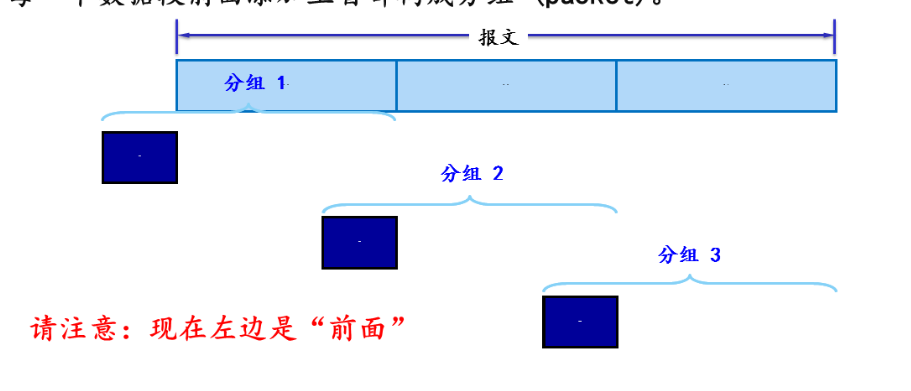
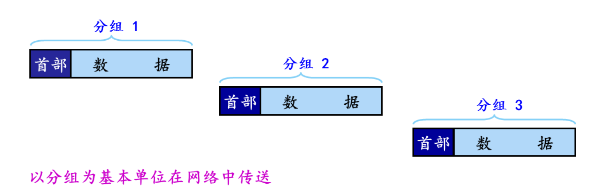

# 计算机网络笔记

## 第一章计算机网络与因特网

###  1. 什么是因特网——因特网的构成

越来越多的非传统因特网“物品”（便携机、游戏机、平板电脑、电视、游戏机）等正在与因特网相连，所有这些设备都叫**主机或者端系统**

> 构成：
>
> 1. 端系统通过**通信链路**和**分组交换机**连接在一起
> 2. 分组交换机从它的一条**入通信链路**接受到达的分组，并从它的一条**出通信链路**转发该分组。
> 3. 分组交换机：**路由器（router）**、**链路交换机（link-layer switch）**。
>    1. 相同点：两种交换机朝着最后总目的地转发分组。
>    2. 不同点：链路层交换机通常用于接入网中，而路由器通常用于网络核心中。
>
> 4. 一个分组所经历的一系列通信链路和分组交换机称为通过该网络的**路径（route  或 path）**
>
> 5. 端系统通过**因特网服务提供商（Internet Service Provide, ISP)**接入因特网，每一个 ISP 自身就是一个由多台分组交换机和多段链路组成的网络。**因特网就是将端系统彼此互联，所以为端系统提供接入的 ISP 也必须互联**。ISP 从低层到高层，互连起来。特点：1.  每一层都是独立管理的 2. 服从 IP 协议 3. 遵循一定命名和地址规则
>
> 6. 端系统、分组交换机和其他因特网部件都要运行一系列的**协议**，**这些协议控制着因特网中公的信息的接受和发送**。
>
>    1. **TCP（Transmission Control Protocol 传输控制协议）**
>    2. **IP（Internet Protocol 网际协议)** ：定义了在路由器和端系统之间的发送和接受的分组格式
>
>    因特网的主要协议统称为**TCP/IP**

###  2. 什么是因特网——因特网的服务

分布式应用程序（distributed application)

运行在一个端系统上的应用程序怎样才能指令互联网向运行在另一个端系统的的软件发送软件呢？

> 与互联网相连的端系统提供了一个**套接字接口（socktet interface）**，该接口规定了运行在端系统上的程序请求因特网基础设施向运行在另一个端系统上的特定的目的地程序交付数据的方式
>
> **因特网套接字接口是一套发送程序必须遵循的规则集合**

### 3. 什么是网络协议

**协议（protocol)**：定义了两个或多个通信实体之间交换的报文的格式和顺序，以及报文发送和接受一条报文或其他事件所采取的动作。

### 网络边缘

#### 一些概念

端系统之所以叫端系统是因为它们位于因特网的边缘。

因特网的端系统包括：桌面计算机，服务器和移动计算机，以及一些非正统物品作为端系统与因特网相连。

端系统被称为**主机（host)**, 主机=端系统

主机有时又被划分为：**客户（client）** 和 **服务器（server）**（所以服务器也是位于因特网的边缘的）

#### 接入网

接入网是指将端系统**物理连接**到其边缘路由器的网络
边缘路由器是端系统到任何其他远程端系统的路径上的第一台路由器
##### 接入网的方式

1. 宽带住宅接入方式：**数字用户线（digital Subscriber Line, DSL)**，电缆，光纤到户（Fiber To The Home, FTTH)(多户共享一个光纤，光纤分布体系结构：有源光纤网络 (Active Opitcal Network)、无源光纤网络（Passive Optical Network, PON)
2. 企业接入：以太网和 WIFI
	1. 使用**局域网（LAN）** 将端系统连接到边缘路由器
	2. 具体过程：无线用户->接入点->企业网（有线以太网）
	3. 基于 IEEE 802.11 技术的无线 LAN 接入俗称 WiFi
3. 广域网无线接入：3 G 和 LTE
##### 物理媒体
物理媒体分为：**导引型媒体**、**非导引型媒体**
1. 导引型媒体：电波沿着固体媒体前行，如光缆、双绞铜或同轴电缆
2. 非导引型媒体：电波在空气或外层空间中传播，如无线局域网或数字卫星频道
具体的物理媒体：
1. 双铜绞线
2. 同轴电缆
3. 光纤
4. 陆地无线电信道
5. 卫星无线电信道
### 网络核心

通过网络链路和交换机移动数据有两种基本方法：**电路交换**(circuit switching ) 和**分组交换**(packet switching )

#### 数据交换方式 ——分组交换

主机将应用报文分解成数据包——分组交换，

**大致过程** ：数据包从一个路由器转发到下一个路由器跨越从源到目的地上路径上的链路。

**特点：**

1. 存储转发：整个包必须到达路由器，然后才能在下一个链路上传输
2. 在发送端先把报文划分成较短的、固定长度的数据段

具体过程：

1. **每个数据段前添加上首部构成分组（packet）**

   **示意图：**


2. **分组交换的传输的单元**
   - 分组交换的网以分组交换作为基本的数据传输单元
   - 依次把各分组发送的到接收端

​	示意图：


3. **收到分组后剥去首部还原成报文**
4. 最后在接收端把收到的**数据恢复成原来的报文**
#####  分组交换的一些规则
- **每一个**分组的首部含有**地址**（如目的地址和源地址）等控制信息
- 分组交换网中的节点交换机根据收到的分组首部中的**地址信息**，把分组**转发**到下一个节点交换机
- 每个分组在互联网中独立的选择传输路径
- 用这样的**存储转发**方式，最后分组就能到达最终**目的地**
- 如果某源端系统或分组交换机经过一条链路发送一个 L 比特的分组，链路的传输速率为 R 比特每秒，则传输该分组的时间是 $\huge \frac{L}{R}$ 秒
##### 存储转发传输
存储转发传输是**指在交换机能够开始向输出链路传输该分组的第一个 bit 之前，必须接收到整个分组。**
多数分组交换机在链路的输入端使用**存储转发传输（store-and-forward transmission)**
每台分组交换机有多条链路与之相连，对于每条相连的链路，该分组交换机具有一个**输出缓存**（output buffer 也称为**输出队列**output queue)，**如果到达的分组需要传输到某条链路，但发现该链路正忙于传输其他分组，该到达分组必须在输出缓存中等待。**

缓存空间有限容易导致**分组丢失（丢包）**（packet loss)
###### 转发表和路由选择协议
每台路由器具有一个**转发表（forward table)** 用于将目的地址（或目的地址的一部分）映射成输出链路。
**路由选择协议**：因特网具有一些特殊的路由选择协议（routing protocol )用于自动的设置这些转发表。

##### 时延
1. 节点处理时延（nodal processing delay)
2. 排队时延 (queuing delay )
3. 传输时延 (transmission  delay)
4. 传播时延 (propagation delay)
这些时延的总体累加起来是**节点总时延（total nodal  delay)**
（1）处理时延
检查分组首部和决定该分组导向何处做需要的时间是**处理时延**的一部分，除此之外还有检查差错
（2）排队时延
在队列中，当分组在链路上等待传输时，它经受的**排队时延。**
排队时延：很大程度上取决与流量达到该队列的速率，链路的传输速率和到达流量的性质即流量是**周期性到达**还是以**突发形式到达**。
令 a 的表示分组到达对列的平均速率（a 的单位是以分组/秒 pkt/s)。R 是传输速率（即从队列中推出比特的速率（以 bps 即 b/s 为单位），假定所有分组的大小都是 L 比特
则比特达到队列的平均速率是 $La \ bps$ 如果 $\frac{La}{R}>1$， （$\frac{La}{R}$ 被称为**流量强度（tranffic intensity）** )则比特到队列的平均速速率大于从队列传输出去的速率，则该队列趋向无线大，排队时延将趋向于无穷大。
（3）传输时延（发送时延）
就是将分组推到链路中所花的时间（不包括排队的时间）
（4）传播时延
分组被推到链路后，从起点到路由器所需要的时间就是**传播时延**
**对应的公式：**
$$
\huge d_{nodal}=d_{proc}+d_{queue}+d_{trans}+d_{prop}
$$
如果连接两台位于同一个大学的路由器的链路而言 $\huge  d_{prop}$ 可能是微不足道的，然而卫星通讯中它却是很大的，
**最大吞吐量**是一台路由器能够转发分组的最大速率，受到处理时延 $d_{prop}$ 的巨大影响


#### 数据交换方式——电路交换

电路交换网络中，**预留了端系统的沿路径通信所需要的资源**（缓存，链路传输速率）。在分组交换中是不预留的。
在发送方能够发送信息之前，该网络必须在发送方和接受方之间建立一条连接，这是名副其实的连接，因为此时沿着发送方和接收方之间路径上的交换机都为该连接维护连接状态
在网络创建这种电路时：**它在连接期间在该网络链路上预留了恒定的传输速率，所以发送方能够以确保恒定的速率向接收方传送数据**

**过程：** 当两台主机要通信时，网络在两台主机之间创建一条专用的端到端连接（是预留的电路）
###### 电路交换网络中的复用

链路中的电路有两种复用：**频分复用**（Frequency-Division Multiplexing FDM) 、**时分复用**（Time-Division Multiplexing FDM)
1. **频分复用**：在连接期间为每条连接专用一个频段。如电话网络中频段的宽度通常是 4 kHz,**该宽度称为带宽（band-width)**, 无线电台也是用 FDM 来共享 88~108 MHz 的频谱
2. **时分复用**：时间被划分为固定期间的帧，并且每个帧有被划分为固定数量的时隙。
	时分复用的具体过程：当网络跨越一条链路创建一条连接时，网络在每个帧中为该连接指定一个时隙，一个时隙内可用与传输该连接的数据。

#### 分组交换和电路交换的对比

分组交换的缺点：
1. 分组交换不适合实时服务（例如电话和视频会议），因为它的端到端时延时可变的和不可预测的（主要因为排队时延的变动和不可预测所致）
分组交换的优点：
1. 提供了比电路交换更好的带宽共享
2. 比电路交换更简答、更有效，实现成本更低
分组交换的性能优于电路交互的性能。
例子一：多并发用户
例子二：突然的高数据量

当今电信网络逐渐向分组交换迁移
#### 计算机网络的吞吐量
**瞬时吞吐量（instantaneous throughput)** 是主机 B 接受到文件的速率以 bps 计
主机 B 接受到所有 F 比特用去 T 秒则文件传送的**平均吞吐量 (average throughput )**
$R_{s}$ 表示服务器与路由器之间的链路速率，$R_{c}$ 表示路由器与客户之间的链路速率
$min\{R_{c},R_{s}   \}$ 是**瓶颈链路（bottleneck link）** 的速率
### 网络的设计模式

1. 分层设计模式
   1. **分层的思想**：每一层完成一种（类）特定服务/功能
      1. 通过层间动作完成相应的功能
      2. 每层以来底层提供的服务
   2. 优点：
      1. 结构清晰
      2. 易于更新、维护
   
   	3. 缺点：降低效率、有些功能重复出现

#### 计算机网络体系结构

是计算机网络的各层及其协议的集合，体系结构是计算机网络的功能层次及其关系的定义

##### 1.1 OSI 参考模型

```
应用层							应用层
表示层							表示层
会话层							会话层
传输层							传输层
网络层							网络层
数据链路层					   数据链路层
物理层		---------------->	物理层
```

##### 1.2 TCP/IP 参考模型      TCP/IP 协议栈

```
应用层					HTTP|FTP|DNS
传输层					TCP  	UDP	
网际层					IP	
网络接口层			   Ethernet ATM Frame Relay	
```

##### 1.3 五层参考模型

```
应用层						应用层
传输层  					传输层
网络层						网络层
数据链路层				   数据链路层
物理层 	------------->	物理层
```
## 第二章应用层
网络应用程序体系结构：客户-服务器体系结构（client-server architrcture), 对等体系结构（P 2 P)

### 进程通信的过程
1. 相同端上的的进程通信通过操作系统确定
2. 不同端上的进程通信通过计算机网络交换**报文**（message）相互通信，**发送进程生成并向网络中发送报文，接收进程接受这些报文并可能通过回送报文进行响应。**
3. 进程通过套接字（socket）的软件接口向网络发送报文和从网络接收报文
	套接字是同一台主机内应用层和传输层的**应用程序编程接口**，
	应用程序可以控制套接字在应用层的一切但是，对于运输层的控制仅限于 1. 选择运输协议 2. 设定几个运输层的参数
4. 进程需要定义两种信息
	1. 主机的地址（主机有 IP 地址标志）
	2. 在目的主机中指定接收进程的标识符（端口号）
5. 选择运输服务
### 可供应用程序使用的运输服务
#### 运输服务的评价
1. 可靠的数据传输
2. 吞吐量
3. 定时
4. 安全性
#### TCP 服务
TCP 服务模型包括：**面向连接服务**和**可靠数据传输服务**
1. 面向连接服务
	在数据报文开始流动前，TCP 让客户和服务器相互交换运输层的控制信息
	在握手阶段后，一个 TCP 连接就在两个进程的套接字之间建立了
2. 可靠的数据传输服务
	通信进程可以依靠 TCP，无差错的按适当顺序交付所有发送数据
3. 拥塞控制机制当接收端和发送端的网络拥塞时，会抑制发送进程。
#### UDP 服务
UDP 不提供不必要服务的轻量级运输协议。
UDP 是无连接的，没有握手过程
UDP 协议不保证该报文将到达接收的进程，而且到达还可能是乱序的
### 应用层协议简介

应用层协议（application-layer protocol)定义了在不同端系统上的应用进程如何传递报文。
1. 交换报文类型，例如请求报文和响应报文
2. 各种报文的语法如报文中各个字段及这些字段是如何描述的
3. 字段的语义
4. 如何发送报文，发送报文的规则
RFC（Request for Comments）是互联网工程任务组（IETF）发布的一系列文档，用于描述互联网相关协议、标准、方法和过程。
Web 应用层协议 HTTP（超文本传输协议）就作为一个 RFC 可供使用
###### 网络应用
1. WEB
2. 文件传输
3. 电子邮件
4. 目录服务
5. 流式视频
6. P 2 P
### Web 和 HTTP
#### HTTP 概述
Web 的应用是层协议是超文本传输协议（HTTP), 他是 Web 的核心
HTTP 由两个程序实现：一个客户程序和一个服务程序，HTTP 定义了这些报文的**结构**以及客户和服务器进行报文**交换的方式**
##### 一些概念
**Web 页面**是由**对象**组成，一个**对象**只是一个文件
多数 Web 界面含有一个**HTML 基本文件（Base html)**
HTTP 使用 TCP 作为它支撑运输协议
客户端的套接字接口时客户进程与 TCP 连接之间的门，在服务器的套接字接口则是服务器进程与 TCP 连接之间的门。
HTTP 不保存任何关于客户的任何信息，所以我们说 HTTP 是一个**无状态协议** (stateless protocol )

非持续连接和持续连接
非持续连接：即每个请求/响应对经过一个单独的 TCP 连接发送，
持续连接：是所有请求及其响应都经相同的 TCP 连接发送
##### 非持续连接的 HTTP
往返时间（Round-Trip Time, RTT）: 一个短分组从客户到服务器然后再返回客户所花费的时间。
RTT 包括分组传播时延，分组在中间路由器和交换机的排队时延以及分组的处理时延
三次握手，前两次给服务器     
### SMTP
simple mail transport protocol 

##   物理层

#### 2.1 通信基础

		##### 2.1.1 三大特性

```
1、机械特性：物理特性，比如引脚数目、接口性状等
2、电气特性：传输二进制位是，线路上的电压范围、阻抗匹配、传输速率、距离限制等
3、功能特性：电平意义、接口部件的信号线用途
```

##### 2.1.2  数据通信

##### *典型的数据通信模型

```
电脑————————>调制解调器————————>公用电话网————————>调制解调器————————>电脑
	数字信号模拟信号模拟信号数字信号
	
*———————————————————————————————————————————————————————————————————————————————————————*	
——————>信源——————>发送器————————>传输系统————————>接收器——————>信宿——————>
输入信息输入数据发送的信号接受的信号输出数据输出信息

```

##### *数据通信相关术语

```
数据：传送信息的实体，通常是有意义的符号序列
信号：数据的电气/电磁的表现，是数据在传输过程中的存在形式
	数字信号：代表消息的参数取值是离散的。_|-|_|-|_
	模拟信号：代表消息的参数取值是连续的。~v~v~v~v~
信源：产生和发送数据的源头
信宿：接收数据的终点
信道：信号的传输媒介。一般用来表示向某一个方向传送信息的介质，因此一条通信线路往往包含一条发送信道和一条接收信道
```

##### *三种通信方式

```
1、单工通信：只有一个方向的通信而没有反方向的交互，仅需要一条信道
2、半双工通信：通信的双方都可以发送或接收消息，但任何一方都不能同时发送和接收，需要两条信道
3、全双工通信：通信双方可以同时发送和接受信息，也需要两条信道
```

##### *两种数据传输方式

```
串行传输：速度慢，费用低，适合远距离
发接
送 0101011101010 收
方方
并行传输：速度快，费用高，适合近距离（用于计算机内部数据传输）
   1->
发 0->  接
送 1 -> 收
方 0->  方
   1->
```

##### 2.1.3 码元、波特、速率、宽带

##### *码元

```简体中文
码元是指用一个固定时长的信号波形（数字脉冲），代表不同离散数值的基本波形，是数字通信中数字信号的计量单位，这个时长内的信号称为 K 进制码元，而该时长称为码元宽度。当码元的离散状态有 M 个时（M 大于 2），此时码元为 M 进制码元。
```

```
1 码元可以携带多个比特的信息量。例如，在使用二进制编码时，只有两种不同的码元，一种代表 0 状态，另一种代表 1 状态。
_|-|_|-|_|-|_
0101010101010
```

```
K 进制码元————4 进制码元————码元的离散状态有 4 个————4 种高低不同的信号波形————00、01、10、11
```

##### *速率

速率也叫数据率，是指数据的传输速率，表示单位时间内传输的数据量。可以用码元传输速率和信息传输速率表示。

###### 1 s 传输多少个码元

```
1）码元传输速率：别名码元速率、波形速率、调制速率、符号速率等，它表示单位时间内数字通信系统所传输的码元个数（也可称为脉冲个数或信号变化的次数），单位是波特（Baud）。1 波特表示数字通信系统 Meiz 每秒传输一个码元。这里的码元可以是多进制的，也可以是二进制的，但码元速率与进制数无关。
```

###### 1 s 传输多少个比特

```
2）信息传输速率：别名信息速率、比特率等，表示单位时间内数字通信系统传输的二进制码元个数（即比特数），单位是比特/秒（b/s）。
```

###### 关系

```
若一个码元携带 n bit 的信息量，则 M Baud 的码元传输速率所对应的信息传输速率为 MXn bit/s。
```

##### *带宽

```
表示单位时间内从网络中的某一点到另一点所能通过的“最高数据率”，常用来表示网络的通信线路所能传输数据的能力。单位是 b/s。
```

##### 2.1.2  奈氏准则/香农定理

##### *奈氏准则

```
在理想低通（无噪声，带宽受限）条件下，为了避免码间串扰，极限码元传输速率为 2 W Baud，W 是信道带宽，单位是 Hz。
```

```
理想低通信道下的极限数据传输率=2 Wlog 2 V（b/s）
W：带宽（Hz）
V：码元的离散电平数目
```

```
1、在任何信道中，码元传输的速率是有上限的，若传输速率超过此上限，就会出现严重的码间串扰问题，使接受端对码元的完全正确识别成为不可能。
2、信道的频带越宽（即能通过的信号高频分量越多），就可以用更高的速率进行码元的有效传输。
3、奈氏准则给出了码元传输速率的限制。但并没有对信息传输速率给出限制。
4、由于码元的传输速率受奈氏准则的限制，所以要提高数据的传输速率，就必须设法使每个码元能携带更多个比特的信息量，这就需要采用多元制的调制方法。
```

##### *香农定理

###### 信噪比

```
噪声存在于所有的电子设备和通信信道中。由于噪声随机产生，它的瞬时值有时会很大，因此噪声会使接收端对码元的判决产生错误。但是噪声的影响是相对的，若信号较强，那么噪声影响相对较小。因此，信噪比就很重要。
信噪比=信号的平均功率/噪声的平均功率。常记为 S/N，并用分贝（dB）作为度量单位，即：
信噪比（dB）=10 lg（S/N） 数值等价
```

###### 香农定理

```
在带宽受限且有噪声的信道中，为了不产生误差，信息的数据传输速率有上限值。
信道的极限数据传输速率=Wlog 2 (1+S/N)(b/s)
W: 带宽（Hz）
S/N：信噪比（S 是信道所传信号的平均功率）（N 是信道内的高斯噪声功率）
```

```
1、信道的带宽或信道中的信噪比越大，则信息的极限传输速率就越高
2、对一定的传输带宽和一定的信噪比，信息传输速率的上限就确定了
3、只要信息的传输速率低于信道的极限传输速率，就一定能找到某种方法来实现无差错的传输。
4、香农定理得出的为极限信息传输速率，实际信道能达到的传输速率要比它低不少。
5、从香农定理可以看出，若信道带宽 W 或信噪比 S/N 没有上限（不可能），那么信道的极限信息传输速率也就没有上限。
```

### 3.1 数据链路层功能概述

结点：主机、路由器

链路：物理通道

数据链路：逻辑通道

帧：传输的最小单元

功能：无确认无连接，有确认无连接、有确认有连接

### 3.2 封装成帧和透明传输

透明传输：帧看不见自己发送的什么

1、字符计数法（容易出错）

2、字符填充法：SOH-装在帧中的数据部分-EOT

3、零比特填充法：5110，遇到 5 个 1 填充一个 0

4、违规编码方式：比如曼彻斯特编码

### 3.3.2 差错控制

差错：位错：10 反了，帧错：丢失、重复、失序

差错控制：检错编码、纠错编码

### 3.4.1 流量控制与可靠传输机制

较高的发送速度和较低的接受能力的不匹配

数据链路层：接收端不发送就不会发

传输层：发送流量窗口给发送端

停止等待协议：发送窗口 1，接收窗口 1

GBN 协议：发送窗口＞1，接收窗口1

SR 协议：发送窗口＞1，接收窗口＞1

### 3.4.2 停止等待协议

无差错情况：

有差错情况：超时计时器，超时重传

ACK 丢失：超时计时器，超时重传，丢弃重复帧

ACK 迟到：丢弃重复帧

信道利用率：发送时间占整个发送周期的比例

### 3.4.2 SR 选择重传协议

两个窗口

发送方的窗口的最低被受到确认后才能往右滑动

接收方同理

Wmax=Wmin=pow (2, n-1)

### 3.4.2 后退 N 帧协议

1、上层的调用

2、收到了一个 ACK

3、超时事件

（GBN 协议）

### 3.5.1 信道划分介质访问控制

点对点：常用于广域网

广播式：

局域网

典型的拓扑结构：总线型、星型

介质访问控制：

静态划分信道：信道划分介质访问控制

（FDM : 并行

、TDM：并发

STMD：动态分配时间隙

、WDM

、CDM）

动态分配通道：

轮询访问介质访问控制：令牌传递协议

随机访问介质访问控制：ALOHA、CSMA、CSMA/CD、CSMA/CA

# 3.5.2 ALOHA 协议

不监听信道、不按时间槽发送、随机重发

时隙 ALOHA 协议：把时间分成若干个相同的时间片

# 3.5.3 CSMA 协议

载波监听多路访问协议

CS：载波监听

MA：多点接入

1-坚持 csma

非坚持 csma

P-坚持 csma

# 3.5.4 轮询访问介质访问控制

MAC 协议：

信道划分介质访问控制

随机访问

轮询访问 MAC 协议

令牌传递协议

# 3.5.5 CSMA-CA 协议

载波监听多点接入/碰撞避免 CSMA/CA

# 3.6.1 局域网基本概念和体系结构

Local Area Network

星型拓扑

总线型拓扑（好）

环形拓扑

树型拓扑

无线局域网 WLAN，采用 IEEE 802.11 标准

LLC

MAC

# 3.6.2 以太网（Ethernet）

便宜、好用

无连接、不可靠

逻辑上总线、物理上星型

10 BASE-T 以太网

# 3.6.3 无线局域网

（帧控制 2）（生存周期 2）（接收端 6）（发送端 6）（目的地址 6）（序列控制 2）（源地址 6）

# 3.7 广域网

PPP 协议：point-to-point

简单

封装成帧

透明传输

多种网络层协议

多种类型链路

差错检测

检测连接状态

最大传送单元

网络层地址协商

数据压缩协商

面向字节

# 总结

